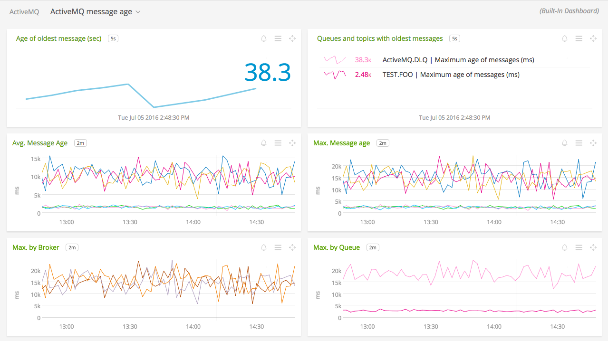
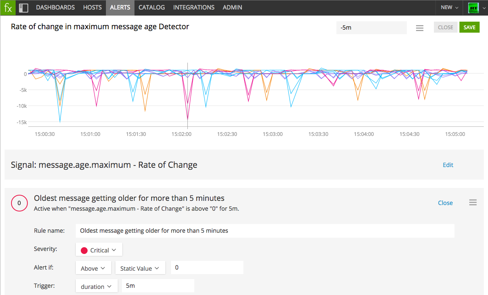

#  ActiveMQ Message Age Listener

_This is a directory that consolidates all the metadata associated with the ActiveMQ message age listener. The relevant code for the plugin can be found [here](https://github.com/signalfx/activemq-integration)_

- [Description](#description)
- [Requirements and Dependencies](#requirements-and-dependencies)
- [Installation](#installation)
- [Configuration](#configuration)
- [Usage](#usage)
- [Metrics](#metrics)
- [License](#license)

### DESCRIPTION

This tool measures the age of messages in ActiveMQ queues, and publishes the results to SignalFx. It actively inspects the messages that are waiting to be delivered in each queue, and therefore is especially useful for detecting messages that are "stuck" in ActiveMQ queues and unable to be delivered. 

To monitor the general health of ActiveMQ, see [SignalFx's ActiveMQ integration](https://github.com/signalfx/integrations/tree/master/collectd-activemq).

#### FEATURES

##### Built-in dashboards (accompanying [SignalFx's ActiveMQ integration](https://github.com/signalfx/integrations/tree/master/collectd-activemq))

- **ActiveMQ Message Age**: Shows the average age of messages in ActiveMQ queues.

  

### REQUIREMENTS AND DEPENDENCIES

| Software  | Version        |
|-----------|----------------|
| ActiveMQ  | 5.8.0 or later |
| Java | 1.5 or later |
| Maven | (match with Java version) |
       
### INSTALLATION

1. Download SignalFx's ActiveMQ message age listener from [https://github.com/signalfx/activemq-integration](https://github.com/signalfx/activemq-integration). 

1. Modify `/activemq-integration/amq-message-age/properties` to provide values that make sense for your environment, as described in [Configuration](#configuration), below.

1. Run the tool as follows, replacing `path/to/` with the location of the files you downloaded in step 1: 

        cd path/to/activemq-integration/amq-message-age
        ./run.sh

### CONFIGURATION

Supply values for the following properties in the `/activemq-integration/amq-message-age/properties` file.

| configuration option | definition | default value |
| ---------------------|------------|---------------|
| path | Filesystem path to ActiveMQ executable | <Path-To-ActiveMQ-Executable>/activemq |
| token | SignalFx API token | <SignalFX-API-TOKEN> |
| sfx_host | Host to which to transmit data | `https://ingest.signalfx.com` |
| interval | Interval at which to measure message age, in milliseconds. | 3000 |
| host | URL at which to connect to ActiveMQ broker. | `tcp://localhost:61616` |
| host_name | Name of this ActiveMQ host. This value appears in the dimension `host` in SignalFx. | ActiveMQ_Host1 |
| broker_name | Name of this ActiveMQ broker. This value appears in the dimension `broker` in SignalFx. | Broker1 |

### USAGE

In some versions of ActiveMQ, messages sometimes get “stuck” in the queue, and message consumers won’t pick them up even if they have available capacity. This bug causes messages to never be delivered. Monitoring tools are typically unable to detect this condition due to a lack of visibility into the messages that never make it out of the queue. 

This tool provides visibility into "stuck" messages in ActiveMQ by inspecting each enqueued message, calculating the average and maximum age of messages per queue, and reporting those metrics to SignalFx using our [Java client library](https://github.com/signalfx/integrations/tree/master/lib-java). 

Our built-in dashboard for this data makes it immediately visible when messages have been waiting a long time to be delivered. 

*In this example, one queue has messages that are nearly 40 seconds old.*

Using these metrics from inside each message queue, we can create intelligent detectors that alert when there’s a message stuck in the queue and unable to be delivered. For example, you can create a detector that fires when the oldest message in the queue has been getting older for at least 5 minutes. To build this, we use the analytics function “Rate of change”, which lets us know how quickly a metric is changing.

*This detector will alert when a message is unable to be delivered for more than 5 minutes.*

In this example, rate of change tells us how much older the oldest message in each queue is getting each time we measure it. When this function is greater than 0, it tells us that a message is sitting in the queue, aging. If this continues for a long time, it could indicate that one or more messages is stuck and not being picked up.

### METRICS

For documentation of the metrics and dimensions emitted by this plugin, [click here](././docs).

### LICENSE

This integration is released under the Apache 2.0 license. See [LICENSE](./LICENSE) for more details.
