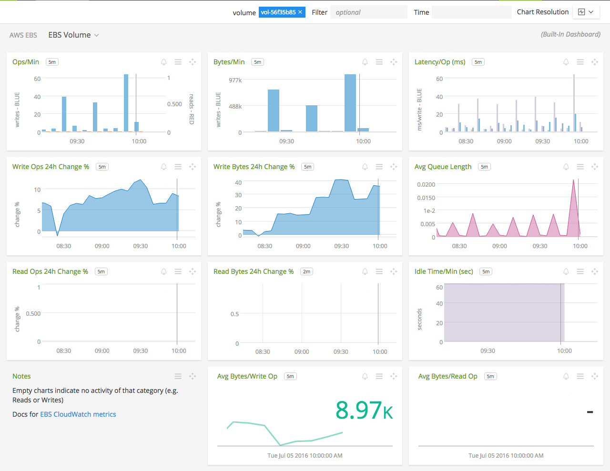

#  Amazon Elastic Block Store (EBS)

- [Description](#description)
- [Installation](#installation)
- [Usage](#usage)
- [Metrics](#metrics)
- [License](#license)

### DESCRIPTION

Use SignalFx to monitor Amazon Elastic Block Store (EBS) via Amazon CloudWatch. 

#### FEATURES

##### Built-in dashboards

- **EBS Volumes**: Overview of all data from EBS.
  
  

- **EBS Volume**: Focus on a single EBS volume.
  
  

### INSTALLATION

To access this integration, connect to CloudWatch on the SignalFx Integrations page. 

By default, SignalFx will import all CloudWatch metrics that are available in your account. To retrieve metrics for a subset of available services or regions, modify the connection on the Integrations page. 

### USAGE

SignalFx provides built-in dashboards for this service. Examples are shown below. 

### METRICS

For more information about the metrics emitted by Amazon Elastic Block Store, click here or visit the service's homepage at https://aws.amazon.com/ebs/.

### LICENSE

This integration is released under the Apache 2.0 license. See [LICENSE](./LICENSE) for more details.
