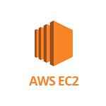
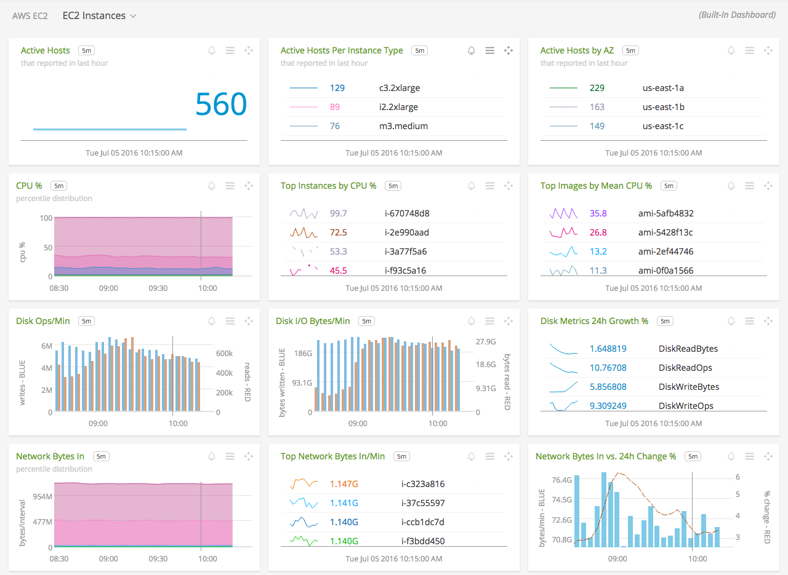

#  Amazon Elastic Compute Cloud (EC2)

- [Description](#description)
- [Installation](#installation)
- [Usage](#usage)
- [Metrics](#metrics)
- [License](#license)

### DESCRIPTION

Use SignalFx to monitor Amazon Elastic Compute Cloud (EC2) via Amazon CloudWatch. 

#### FEATURES

##### Hosts Page

- **Host Navigator**: On the Hosts page in SignalFx, the Host Navigator visualizes EC2 instances as squares, colored by CloudWatch metrics including CPU, disk, and network. Group and filter instances by AWS metadata like availability zone or service tag in order to discover trends and correlations. [Click here to read more about the Hosts Page](http://docs.signalfx.com/en/latest/built-in-content/host-nav.html). 

  

##### Built-in dashboards

- **EC2 Instances**: Overview of all data from EC2.
  
  

- **EC2 Instance**: Focus on a single EC2 instance.
  
  

### INSTALLATION

To access this integration, connect to CloudWatch on the SignalFx Integrations page. 

By default, SignalFx will import all CloudWatch metrics that are available in your account. To retrieve metrics for a subset of available services or regions, modify the connection on the Integrations page. 

### USAGE

SignalFx provides built-in dashboards for this service. Examples are shown below. 

### METRICS

For more information about the metrics emitted by Amazon EC2, click here or visit the service's homepage at https://aws.amazon.com/ec2/.

### LICENSE

This integration is released under the Apache 2.0 license. See [LICENSE](./LICENSE) for more details.
