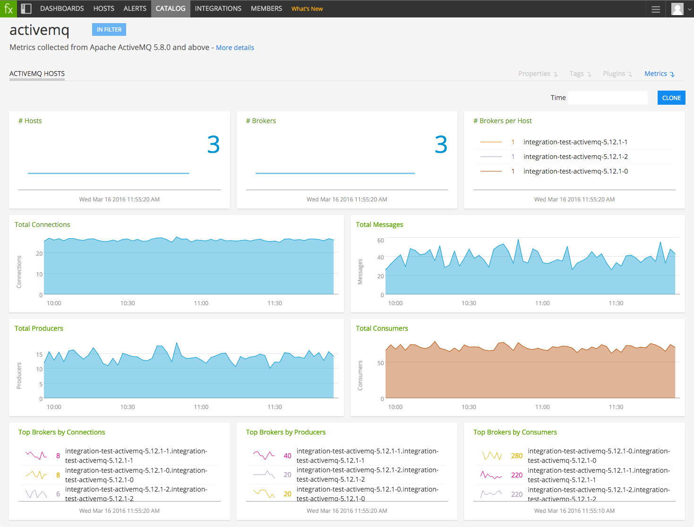

#  ActiveMQ

_This is a directory that consolidates all the metadata associated with SignalFx's integration with ActiveMQ. The relevant code for the plugin can be found [here](https://github.com/signalfx/activemq-integration)_

- [Description](#description)
- [Requirements and Dependencies](#requirements-and-dependencies)
- [Installation](#installation)
- [Configuration](#configuration)
- [Usage](#usage)
- [Metrics](#metrics)
- [License](#license)

### DESCRIPTION

SignalFx's integration with ActiveMQ configures the Java plugin for collectd to monitor ActiveMQ.

Use this plugin to monitor the following types of information from ActiveMQ:

* Broker (Totals per broker)
* Queue (Queue status)
* Topic (Topic status)

#### FEATURES

##### Built-in dashboards

- **ActiveMQ Hosts**: Overview of all data from ActiveMQ hosts.

  

- **ActiveMQ Host**: Focus on a single ActiveMQ host.

  

- **ActiveMQ Queue**: Focus on a single ActiveMQ queue.

  

- **ActiveMQ Topic**: Focus on a single ActiveMQ topic.

  

- **ActiveMQ Message Age**: (if enabled) Shows the average age of messages in ActiveMQ queues.

  

### REQUIREMENTS AND DEPENDENCIES

Use SignalFx's configuration of the collectd Java plugin to collect metrics about Apache ActiveMQ. An example config file for collecting data about ActiveMQ using this plugin can be found in our [collectd configs repo](https://github.com/signalfx/signalfx-collectd-configs/blob/master/managed_config/20-activemq.conf).

| Software  | Version        |
|-----------|----------------|
| collectd  |  4.9 or later  |
| ActiveMQ  | 5.8.0 or later |
| [Java plugin for collectd](../collectd-java) <!--sfx_link:collectd-java --> |  (match collectd version) | 
       
### INSTALLATION

1. RHEL/CentOS and Amazon Linux users: Install the [Java plugin for collectd](../collectd-java)<!--sfx_link:collectd-java --> if it is not already installed. 

1. Download SignalFx's example ActiveMQ configuration file to `/etc/collectd/managed_config`:  [`20-activemq.conf`](https://github.com/signalfx/integrations/blob/master/collectd-activemq/20-activemq.conf)

1. Modify `20-activemq.conf` to provide values that make sense for your environment, as described in [Configuration](#configuration), below.

1. Restart collectd.

### CONFIGURATION

Using the example configuration file [`20-activemq.conf`](././20-activemq.conf) as a guide, provide values for the configuration options listed below that make sense for your environment and allow you to connect to the ActiveMQ instance to be monitored.

| configuration option | definition | example value |
| ---------------------|------------|---------------|
| Host | The name of this ActiveMQ broker. Appears as dimension `host` in SignalFx. 
 Note: Do not modify or remove the `[hostHasService=activemq]` section. | `"ActiveMQ_Host1[hostHasService=activemq]"` |
| ServiceURL | URL of the ActiveMQ service. | `ServiceURL "service:jmx:rmi:///jndi/rmi://localhost:1099/jmxrmi"` |

### USAGE

Sample of pre-built dashboard in SignalFx:

### METRICS

For documentation of the metrics and dimensions emitted by this plugin, [click here](././docs).

### LICENSE

This integration is released under the Apache 2.0 license. See [LICENSE](./LICENSE) for more details.
