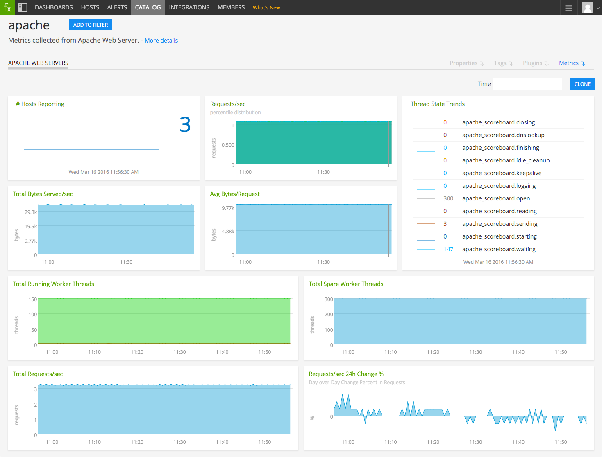

# Apache collectd Plugin

_This is a directory consolidate all the metadata associated with the Apache collectd plugin. The relevant code for the plugin can be found [here](https://github.com/signalfx/collectd/blob/master/src/apache.c)_

- [Description](#description)
- [Requirements and Dependencies](#requirements-and-dependencies)
- [Installation](#installation)
- [Configuration](#configuration)
- [Usage](#usage)
- [Metrics](#metrics)
- [License](#license)

### DESCRIPTION
Follow these instructions to install the Apache plugin for collectd. This will send data about Apache to SignalFx, enabling built-in Apache monitoring dashboards.

### REQUIREMENTS AND DEPENDENCIES
Use the [Apache collectd plugin](https://collectd.org/wiki/index.php/Plugin:Apache) to collect metrics about Apache Webserver.  This plugin collects metrics from the module `mod_status`.

Apache worker threads can be in one of the following states:

| State        | Remark                                  |
|--------------|-----------------------------------------|
| Open         | Open (unused) slot - no process         |
| Waiting      | Idle and waiting for request            |
| Sending      | Serving response                        |
| KeepAlive    | Kept alive for possible next request    |
| Idle_cleanup | Idle and marked for cleanup             |
| Closing      | Closing connection                      |
| Logging      | Writing to log file                     |
| Reading      | Reading request                         |
| Finishing    | Finishing as part of graceful shutdown  |
| Starting     | Starting up to serve                    |

### Version information

| Software  | Version        |
|-----------|----------------|
| collectd  |  3.9 or later  |


### INSTALLATION

1. [Enable the `mod_status` module](http://httpd.apache.org/docs/2.4/mod/mod_status.html) in your Apache server.

1. Add the following configuration to your Apache server:

 ```
 ExtendedStatus on
 <Location /mod_status>
   SetHandler server-status
 </Location>
 ```

1. Restart apache.

1. Install the apache collectd plugin.

 #### Ubuntu 12.04, 14.04, 15.04 & Debian 7, 8:

 This plugin is included with [SignalFx's collectd package](https://github.com/signalfx/integrations/tree/master/collectd).

 #### RHEL/CentOS 6.x & 7.x, and Amazon Linux 2014.09, 2015.03 & 2015.09

 Run the following command to install this plugin:

 ```
 yum install collectd-apache
 ```

1. Download SignalFx's [sample configuration file](https://github.com/signalfx/integrations/collectd-apache/10-apache.conf) for this plugin.

1. Modify the sample configuration file to provide values that make sense for your environment, as described in the header.

###### Note: Make sure that the URL you provide for your `mod_status` module ends in `?auto`. This returns the status page as text/plain, which this plugin requires.

1. Add the following line to /etc/collectd.conf, replacing the example path with the location of the configuration file you downloaded in step 2:

 ```
 include '/path/to/10-apache.conf'
 ```

1. Restart collectd.

1. Metrics from apache will begin streaming into SignalFx, and new built-in dashboards will be created for you. Check the status of your new integration on the Integrations page.

### CONFIGURATION

#### System configuration:

Add the following to your apache config:
 ```
 ExtendedStatus on
  <Location /mod_status>
    SetHandler server-status
  </Location>
 ```

#### Config file modifications:

| Value | Description |
|-------|-------------|
| URL | The location of your `mod_status` |

### USAGE

Sample of pre-built dashboard in SignalFx:



### METRICS

For documentation of the metrics and dimensions emitted by this plugin, [click here](././docs).

### LICENSE

License for this plugin can be found [in the header of the plugin](https://github.com/signalfx/collectd/blob/master/src/apache.c).
