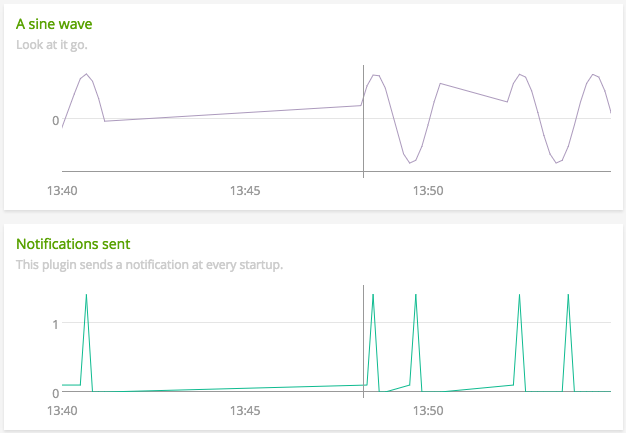

> Fill in the structured header above to allow products like SignalFx to programmatically display this document.

# Example Python Plugin

- [Description](#description)
- [Requirements and Dependencies](#requirements-and-dependencies)
- [Installation](#installation)
- [Configuration](#configuration)
- [Usage](#usage)
- [Metrics](#metrics)
- [License](#license)

### DESCRIPTION

The Docker UCP plugin collects events from Docker UCP related to containers.  The plugin uses the Docker Remote API and log events emitted by Docker UCP to a remote syslog server.
This plugin emits 2 metrics:
- one counter representing the number of events sent in a given interval

The plugin also emits a notification when a container is created, restarted, scaled, renamed, deleted, and stopped.

### REQUIREMENTS AND DEPENDENCIES

This plugin requires:

| Software          | Version        |
|-------------------|----------------|
| collectd          |     4.9+       |
| Python plugin for collectd | (included with SignalFx collectd) |
| Python            |     2.6+       |
| Docker UCP        |                |
| rsyslogd          |                |

* A working Docker UCP controller
** Must be configured to forward info level log statements to a remote syslog server
* A remote syslog server

### INSTALLATION

>In this section, provide step-by-step instructions that a user can follow to install this plugin. Each step should allow the user to verify that it has been completed successfully.
>
>This section should also contain instructions for any steps that the user must take to modify or reconfigure the software to be monitored. For instance, the plugin might collect data from an API endpoint that must be enabled by the user.

Follow these steps to install this plugin:
Requirements: 
->*Docker UCP Controller
->*Remote Syslog Server
'''
* Collectd and the Docker UCP plugin will be installed on the remote syslog server
* The Docker UCP instanc must be configured to forward info level log statements to the remote syslog server.
'''
1. Download the [collectd-docker-ucp](https://github.com/signalfx/collectd-docker-ucp) repository to a remote syslog server.
2. Download the Docker UCP Client bundle found in the Docker UCP settings and unzip it to a directory on the remote syslog server
3. Modify the sample configuration file [docker-ucp.conf](https://github.com/signalfx/integrations/blob/master/collectd-docker-ucp/docker-ucp.conf) to contain values that make sense for your environment, as described [below](#configuration).
4. Add the following line to `collectd.conf`, replacing the path with the path to the sample configuration file you modified in step 2:

  ```
  include '/path/to/docker-ucp.conf'
  ```
4. Restart collectd.

### CONFIGURATION

Using the configuration file [docker-ucp.conf](https://github.com/signalfx/integrations/blob/master/collectd-docker-ucp/docker-ucp.conf) as a guide, provide values for the configuration options listed below that make sense for your environment.

| configuration option | definition | example value |
| ---------------------|------------|---------------|
| ModulePath | Path on disk where collectd can find this module. | "/opt/collectd-docker-ucp" |
| FilePath   | Path to the remote syslog log where ucp will be forwarding log events. | "/var/log/syslog" |
| UCPHost    | Address of the UCP controller | "192.168.1.100" |
| UCPPort    | Port for accessing the Docker Remote API served from the UCP controller | "443" |
| ClientBundlePath | Path to the uncompressed client bundle downloaded from the docker UCP controller. | "/opt/collectd-docker-ucp/bundle" |
| Debug | Turns on verbose log statements | "True" or "False" |

### USAGE

This plugin is an example that emits values on its own, and does not connect to software. It emits event notifications and a count of notifications emitted in the metrics `counter.docker-ucp-notifications` and `objects.docker-ucp` respectively.

#### Important conditions to watch out for

*`counter.docker-ucp-notifications` shows a suddenly high value.*



This plugin emits a notification at every startup. If your collectd configuration and plugins do not ordinarily emit notifications, a suddenly high value for `counter.notifications` may indicate that collectd has been restarted. In the example charts shown above, `counter.notifications` shows a spike at about the same time as data resumes in `gauge.sine`.

### METRICS

For documentation of the metrics and dimensions emitted by this plugin, [click here](././docs).

### LICENSE

This plugin is released under the Apache 2.0 license. See [LICENSE](https://github.com/signalfx/collectd-docker-ucp/blob/master/LICENSE) for more details.
