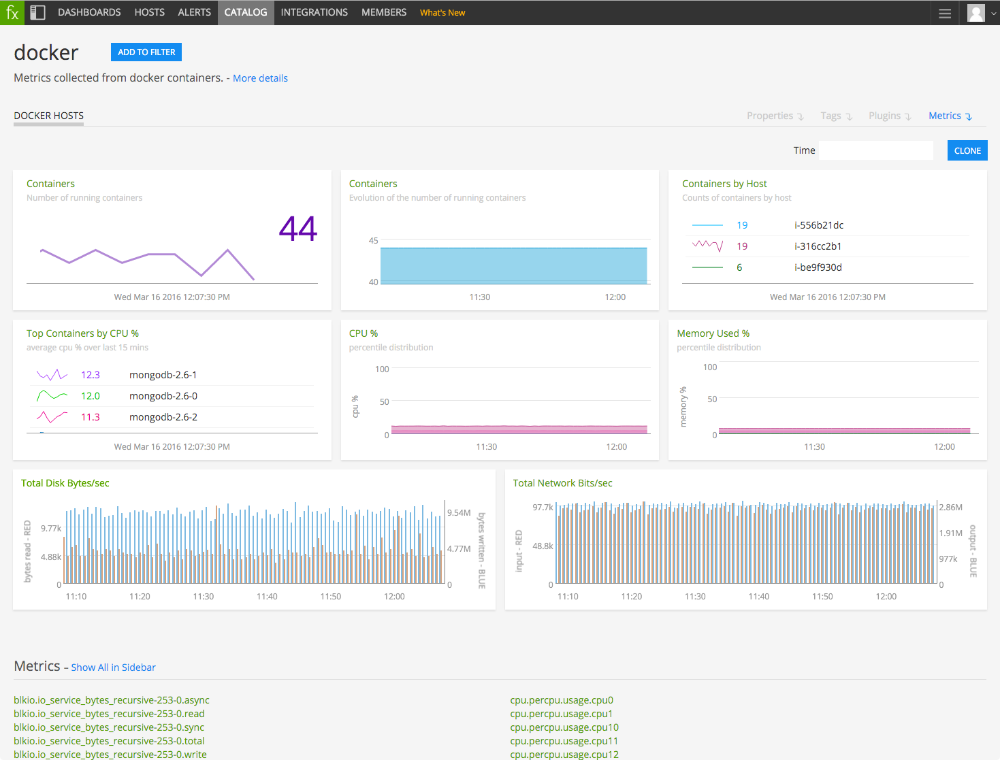

# Docker Plugin

_This is a directory consolidate all the metadata associated with the Docker collectd plugin. The relevant code for the plugin can be found [here](https://github.com/signalfx/docker-collectd-plugin)_

- [Description](#description)
- [Requirements and Dependencies](#requirements-and-dependencies)
- [Installation](#installation)
- [Configuration](#configuration)
- [Usage](#usage)
- [Metrics](#metrics)
- [License](#license)

### DESCRIPTION

This is the SignalFx Docker plugin. Follow these instructions to install the Docker plugin for collectd.

The [`docker-collectd`](https://github.com/signalfx/docker-collectd) plugin collects metrics about the Docker containers running on the system using Docker's stats API. It reports metrics about the CPU utilization of each container, their memory consumption, and their network and disk activity.

All metrics reported by the Docker collectd plugin will contain the following dimensions:

* `host` will contain the hostname (as known by collectd) of the machine reporting the metrics
* `plugin` is always set to `docker`
* `plugin_instance` will contain the name of the container the metrics are from. The container name is used because that's usually a more stable value than the container ID, which changes on every restart

### REQUIREMENTS AND DEPENDENCIES


#### Version information

| Software | Version      |
|----------|--------------|
| collectd | 5.x or later |
| Python   | 2.6 or later |
| Docker   | 1.5 or later |

### INSTALLATION

1. Install the Python plugin for collectd.

 ##### RHEL/CentOS 6.x & 7.x, and Amazon Linux 2014.09, 2015.03 & 2015.09

 Run the following command to install the Python plugin for collectd:
 ```
 yum install collectd-python
 ```
 ##### Ubuntu 12.04, 14.04, 15.04 & Debian 7, 8:

 This plugin is included with [SignalFx's collectd package](https://github.com/signalfx/integrations/tree/master/collectd).

1. Download the Python module from the following URL:

 https://github.com/signalfx/docker-collectd-plugin

1. Run the following command to install the module’s dependencies using pip, replacing the example path with the location of the module you downloaded in step 2:
 ```
 pip install -r /path/to/docker-collectd-plugin/requirements.txt
 ```
 
 *Note*: Amazon Linux users must install a version of pip that will correctly install this module's dependencies. If you're installing this plugin on an Amazon Linux system, run the following commands instead:
 ```
 yum install python26-pip
 pip-2.6 install -r /path/to/docker-collectd-plugin/requirements.txt
 ```
1. Download SignalFx’s [sample configuration file](https://github.com/signalfx/integrations/blob/master/collectd-docker/10-docker.conf).

1. Modify the configuration file as follows:

 1. Modify the fields “TypesDB and “ModulePath” to point to the location on disk where you downloaded the Python module in step 2.

 1. Provide values that make sense for your environment, as described [below](#configuration).

1. Add the following line to /etc/collectd.conf, replacing the example path with the location of the configuration file you downloaded in step 4:
 ```
 include '/path/to/10-docker.conf'
 ```
1. Restart collectd.

collectd will begin emitting metrics from Docker.

### CONFIGURATION

#### Optional configuration

The following configuration options are *optional*. You may specify them in the configuration file in order to override default values provided by the plugin.

| configuration option | definition | default value |
| ---------------------|------------|---------------|
| TypesDB | Path on disk where collectd can find the Types.db file included in this module. | "/usr/share/collectd/docker-collectd-plugin/dockerplugin.db" |
| ModulePath | Path on disk where collectd can find this module. | "/usr/share/collectd/docker-collectd-plugin" |
| BaseURL | URL of your Docker daemon's remote API | "unix://var/run/docker.sock" |
| Timeout  | Time in seconds that collectd will wait for a response from Docker   | 3 |

### USAGE

Sample of pre-built dashboard in SignalFx:



### METRICS

For full documentation of the metrics and dimensions emitted by this plugin, see the `docs` directory in this repository.

### LICENSE

This plugin is released under the Apache 2.0 license. See [LICENSE](https://github.com/signalfx/docker-collectd-plugin/blob/master/LICENSE) for more details.
