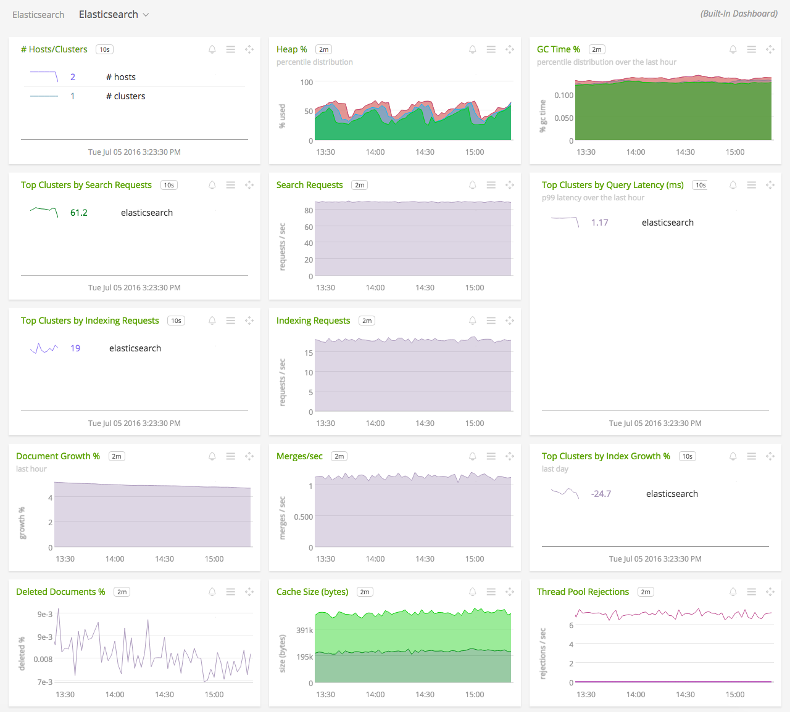

# Elasticsearch Plugin

_This is a directory consolidate all the metadata associated with the Elasticsearch collectd plugin. The relevant code for the plugin can be found [here](https://github.com/signalfx/collectd-elasticsearch)_

- [Description](#description)
- [Requirements and Dependencies](#requirements-and-dependencies)
- [Installation](#installation)
- [Configuration](#configuration)
- [Usage](#usage)
- [Metrics](#metrics)
- [License](#license)

### DESCRIPTION

This is the SignalFx Elasticsearch plugin. This will send data about Elasticsearch to SignalFx, enabling built-in Elasticsearch monitoring dashboards.

Use this plugin to monitor the following types of information from an Elasticsearch node:
  * node statistics (cpu, os, jvm, indexing, search, thread pools, etc..)
  * per-index statistics
  * cluster statistics

Original Elasticsearch Documentation https://www.elastic.co/guide/en/elasticsearch/reference/current/index.html

### REQUIREMENTS AND DEPENDENCIES

#### Version information

| Software          | Version        |
|-------------------|----------------|
| collectd          | 4.9 or later   |
| Elasticsearch     | 1.0.0 or later |

### INSTALLATION

1. Install the Python plugin for collectd.

 ##### RHEL/CentOS 6.x & 7.x, and Amazon Linux 2014.09, 2015.03 & 2015.09

 Run the following command to install the Python plugin for collectd:
 ```
 yum install collectd-python
 ```
 ##### Ubuntu 12.04, 14.04, 15.04 & Debian 7, 8:

 This plugin is included with [SignalFx's collectd package](https://support.signalfx.com/hc/en-us/articles/208080123).

1. Download the Python module from the following URL:

 https://github.com/signalfx/collectd-elasticsearch

1. Download SignalFx’s [sample configuration file](https://github.com/signalfx/integrations/blob/master/collectd-elasticsearch/20-elasticsearch.conf).

1. Modify the configuration file as follows:

 1. Modify the fields “TypesDB and “ModulePath” to point to the location on disk where you downloaded the Python module in step 2.

 1. Provide values that make sense for your environment, as described [below](#configuration).

1. Add the following line to /etc/collectd.conf, replacing the example path with the location of the configuration file you downloaded in step 4:
 ```
 include '/path/to/20-elasticsearch.conf'
 ```
1. Restart collectd.

collectd will begin emitting metrics from Elasticsearch.

### CONFIGURATION

Using the example configuration file [`20-elasticsearch.conf`](././20-elasticsearch.conf) as a guide, provide values for the configuration options listed below that make sense for your environment and allow you to connect to the Elasticsearch instance to be monitored.

| configuration option | definition | default value |
| ---------------------|------------|---------------|
| ModulePath | Path on disk where collectd can find this module. | "/opt/setup/scripts" |
| Verbose | Enable verbose logging. | false |
| Cluster | A name for this cluster. Appears in the dimension `cluster`. | "elasticsearch" |
| Indexes | Identifies the indexes for which the plugin should collect statistics. See note below. | ["_all"] |
| EnableIndexStats | Enable or disable collection of index statistics. | false |
| EnableClusterHealth | Enable or disable collection of cluster health statistics. | true |
| Interval | The interval in seconds at which the plugin will report metrics, independent of the overall collectd collection interval. | 10 |

 If you are running the Elasticsearch plugin via a collectd deployment within a container, please configure the Host and Port values inside of the 20-elasticsearch.conf file that correspond to the desired Elasticsearch instance.
 
 ex:
```
   <Module "elasticsearch_collectd">
       Host "XXX.XXX.XXX.XXX"
       Port "XXXX"
   </Module>
```


#### Note: Collecting index statistics

By default, the configuration parameter Indexes is set to `"_all"`. This means that when EnableIndexStats is set to `true`, the plugin will collect statistics about all indexes. To collect statistics from only one index, set the configuration parameter Indexes to the name of that index: for example, `["index1"]`. To collect statistics from multiple indexes (but not all), include them as a comma-separated list: for example, `["index1", "index2"]`. 
 
SignalFx recommends enabling index statistics collection only on master-eligible Elasticsearch nodes.

The call to collect index statistics can be CPU-intensive. For this reason SignalFx recommends using the `Interval` configuration parameter to decrease the reporting interval for nodes that report index statistics. 

### USAGE

Sample of pre-built dashboard in SignalFx:



### METRICS

For full documentation of the metrics and dimensions emitted by this plugin, see the `docs` directory in this repository.

### LICENSE

This plugin is released under the Apache 2.0 license. See [LICENSE](https://github.com/signalfx/collectd-elasticsearch/blob/master/LICENSE.txt) for more details.
