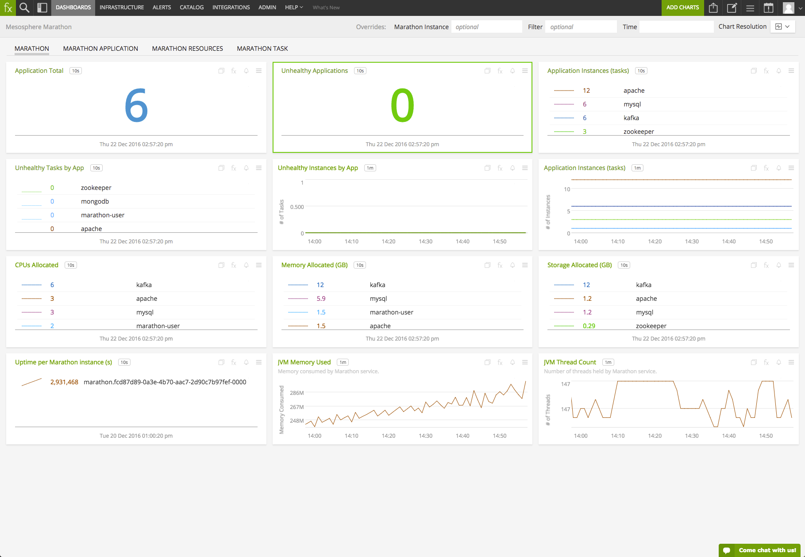

# Marathon

_This directory consolidates all the metadata associated with the Marathon plugin for collectd.  The relevant code for the plugin can be found [here](https://github.com/signalfx/collectd-marathon)_

- [Description](#description)
- [Requirements and Dependencies](#requirements-and-dependencies)
- [Installation](#installation)
- [Configuration](#configuration)
- [Usage](#usage)
- [Metrics](#metrics)
- [License](#license)

### DESCRIPTION
A collectd python based plugin for collecting metrics from Marathon.

#### Features
##### Built-in dashboards

- **Marathon**: Overview of Marathon environment.

  [](./img/dashboard_marathon_overview.png)

- **Marathon Application**: Focus on a Marathon Applications.

  [](./img/dashboard_marathon_application.png)

- **Marathon Resources**: Focus on a Marathon Resource Allocation.

  [](./img/dashboard_marathon_resources.png)

- **Marathon Task**: Focus on a Marathon Tasks.

  [](./img/dashboard_marathon_task.png)

### REQUIREMENTS AND DEPENDENCIES

#### Version information

| Software | Version      |
|----------|--------------|
| collectd | 5.0 or later |
| Python   | 2.6 or later |
| Marathon | 1.1.1 or later |
| Python plugin for collectd | (included with [SignalFx collectd agent](https://github.com/signalfx/integrations/tree/master/collectd)[](sfx_link:sfxcollectd)) |

### INSTALLATION
1.  Ensure that the Marathon api is accessible from the host running the plugin.
2.  Download the [collectd-marathon](https://github.com/signalfx/collectd-marathon) Python module
3.  Install the pip `requirements.txt` file contained in the collectd-marathon repository
    ```
    $ pip install -r requirements.txt
    ```
4.  Place the contents of the repo in /usr/share/collectd/collectd-marathon
5.  Download SignalFx’s [sample configuration file](https://github.com/signalfx/integrations/blob/master/collectd-marathon/20-collectd-marathon.conf) for this plugin to `/etc/collectd/managed_config`.
6.  Modify the configuration file to provide values that make sense for your environment, as described in [Configuration](#configuration) below.
7.  Restart collectd.

### CONFIGURATION
Using the sample configuration file [20-collectd-marathon.conf](https://github.com/signalfx/integrations/blob/master/collectd-marathon/20-collectd-marathon.conf) as a guide, provide values for the configuration options listed below that make sense for your environment.

| configuration option | definition | default value |
| ---------------------|------------|---------------|
| ModulePath | Path on disk where collectd can find this module. | `"/usr/share/collectd/collectd-marathon"` |
| Import | Path to the name of the pythom module with out the .py extension | `marathon` |
| LogTraces | Logs traces from the plugin's execution | `true` |
| verbose | Turns on verbose log statements | `False` |
| host | A python list of `["<host>", "<port>", "username", "password"]`.  The `username` and `password` are only required for Basic Authentication with the Marathon Api.|  |

### USAGE
All metrics reported by the Marathon collectd plugin will contain the following dimensions:
- `host` will contain the hostname (as known by collectd) of the machine reporting the metrics.
- `plugin` is always set to `marathon`.
- `plugin_instance` will always be `marathon` concated with `.` and the Mesos agent id. Ex. `marathon.<mesos agent id>`.

Sample of pre-built dashboard in SignalFx:


### METRICS
For full documentation of the metrics and dimensions emitted by this plugin, see the `docs` directory in this repository.

### LICENSE

See [LICENSE](./LICENSE)
