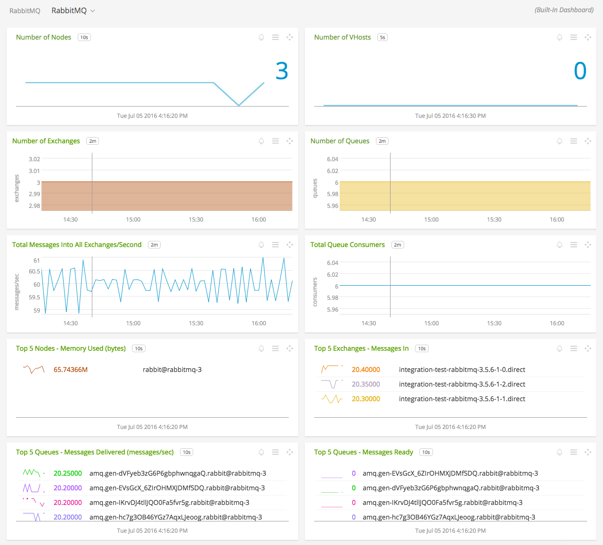

#  RabbitMQ collectd Plugin

_This is a directory that consolidates all the metadata associated with the RabbitMQ collectd plugin. The relevant code for the plugin can be found [here](https://github.com/signalfx/collectd-rabbitmq)_

- [Description](#description)
- [Requirements and Dependencies](#requirements-and-dependencies)
- [Installation](#installation)
- [Configuration](#configuration)
- [Usage](#usage)
- [Metrics](#metrics)
- [License](#license)

### DESCRIPTION

The RabbitMQ plugin that collects statistics from RabbitMQ. The plugin uses the [RabbitMQ Management HTTP API](http://hg.rabbitmq.com/rabbitmq-management/raw-file/rabbitmq_v3_3_4/priv/www/api/index.html) to poll for statistics on a RabbitMQ server, then reports them to collectd.

#### FEATURES

##### Built-in dashboards

- **RabbitMQ**: Overview of data from all RabbitMQ nodes.

  [](./img/dashboard_rabbitmq.png)

- **RabbitMQ Node**: Focus on a single RabbitMQ node.

  [](./img/dashboard_rabbitmq_node.png)  

### REQUIREMENTS AND DEPENDENCIES

This plugin requires:

| Software          | Version        |
|-------------------|----------------|
| collectd | 4.9+ |
| Python plugin for collectd | (match with collectd version) |
| Python |  2.6+  |
|RabbitMQ | 3.0+ |
|RabbitMQ Management plugin | (match with RabbitMQ version)|

### INSTALLATION

1. Install the Python plugin for collectd.

 **RHEL/CentOS 6.x & 7.x, and Amazon Linux 2014.09, 2015.03 & 2015.09**

 Run the following command to install the Python plugin for collectd:

         yum install collectd-python


 **Ubuntu 12.04, 14.04, 15.04 & Debian 7, 8:**

 This plugin is included with [SignalFx's collectd package](https://github.com/signalfx/integrations/tree/master/collectd).

1. Download the [RabbitMQ Python module]( https://github.com/signalfx/collectd-rabbitmq/)

1. Download SignalFx’s [sample configuration file](https://github.com/signalfx/integrations/blob/master/collectd-rabbitmq/10-rabbitmq.conf).

1. Modify the configuration file as follows:

 1. Modify the fields “TypesDB and “ModulePath” to point to the location on disk where you downloaded the Python module in step 2.

 1. Provide values that make sense for your environment, as described [below](#configuration).

1. Add the following line to /etc/collectd.conf, replacing the example path with the location of the configuration file you downloaded in step 3:

         include '/path/to/10-rabbitmq.conf'

1. Restart collectd.

collectd will begin emitting metrics from RabbitMQ.

### CONFIGURATION

#### REQUIRED CONFIGURATION

| Configuration Option | Type | Definition |
|----------------------|------|------------|
| Username | username| name of authorized user |
| Password | password| password for authorized user|
|Host | host| name of host |
|Port| number | port number to listen for RabbitMQ |

#### OPTIONAL Configuration

| Configuration Option | Type | Definition |
|----------------------|------|------------|
|CollectChannels| true/false| toggles the collection of `channels` metrics |
|CollectConnections| true/false| toggles the collection of `connections` metrics|
|CollectExchanges |true/false| toggles the collection of `exchanges` metrics|
|CollectNodes |true/false| toggles the collection of `nodes` metrics|
|CollectQueues | true/false | toggles the collection of `queues` metrics|
| HTTPTimeout | time (seconds) | will set a timeout value for connecting to the RabbitMQ Management API (defaults to 60 seconds)|
| FieldLength | int | Set the number of characters used to encode dimension data. This option should only be specified if you are running the SignalFx fork of collectd, or you specifically compiled collectd with a non-default value for `DATA_MAX_NAME_LEN` in `plugin.h` |
| VerbosityLevel | info/debug/trace | Representation of the quantity of metrics generated by RabbitMQ that are actually reported to SignalFx. If not specified, the default value is `info`. The verbosity levels are as follows: <ui><li>`info`: Only the most commonly-used metrics are reported</li><li>`debug`: Additonal metrics useful for debugging are reported</li><li>`trace`: All available metrics are reported</li></ui> |

### USAGE

Sample of pre-built dashboard in SignalFx:


#### Metric naming

When collectd is configured to publish metrics to SignalFx, metrics from this plugin will be named according to the format:

```
<metric type>.<category>.<statistic>
```

For example:

```
gauge.connection.recv_oct_details.rate
counter.connection.send_oct
gauge.queue.message_stats.deliver_get_details.rate
```

### METRICS

For documentation of the metrics and dimensions emitted by this plugin, [click here](././docs).

### LICENSE

This plugin is released under the Apache 2.0 license. See [LICENSE](https://github.com/signalfx/collectd-rabbitmq/blob/master/LICENSE) for more details.
