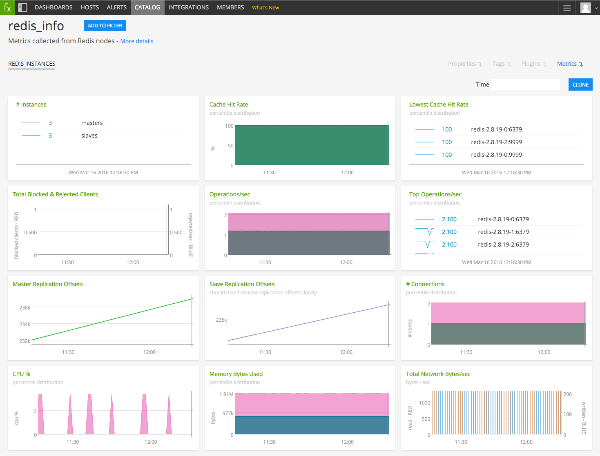

#  Redis collectd Plugin

_This is a directory consolidate all the metadata associated with the Redis collectd plugin. The relevant code for the plugin can be found [here](https://github.com/signalfx/redis-collectd-plugin)_

- [Description](#description)
- [Requirements and Dependencies](#requirements-and-dependencies)
- [Installation](#installation)
- [Configuration](#configuration)
- [Usage](#usage)
- [Metrics](#metrics)
- [License](#license)

### DESCRIPTION

A [Redis](http://redis.io) plugin for [collectd](http://collectd.org) using collectd's [Python plugin](http://collectd.org/documentation/manpages/collectd-python.5.shtml).

You can capture any kind of Redis metrics like:

 * Memory used
 * Commands processed per second
 * Number of connected clients and slaves
 * Number of blocked clients
 * Number of keys stored (per database)
 * Uptime
 * Changes since last save
 * Replication delay (per slave)

### REQUIREMENTS AND DEPENDENCIES

This plugin requires:

| Software          | Version        |
|-------------------|----------------|
| collectd   |  5.0+  |
| credis (C library implementing the redis protocol)| 0.2.3+ |
| redis | 2.8+ |

From [collectd wiki](https://collectd.org/wiki/index.php/Plugin:Redis):

> The credis library is lagging support for current redis, and requires at least the following patch:

> ```
--- ../credis_2/credis-0.2.3/credis.c   2010-08-27 01:57:25.000000000 -0700
+++ ../credis-0.2.3/credis.c    2014-01-28 22:39:42.000000000 -0800
@@ -754,7 +754,7 @@
    * first 1.1.0 release(?), e.g. stable releases 1.02 and 1.2.6 */
   if (cr_sendfandreceive(rhnd, CR_BULK, "INFO\r\n") == 0) {
     int items = sscanf(rhnd->reply.bulk,
-                       "redis_version:%d.%d.%d\r\n",
+                       "# Server\r\nredis_version:%d.%d.%d\r\n",
                        &(rhnd->version.major),
                        &(rhnd->version.minor),
                        &(rhnd->version.patch));
```

> * see brief notes on [configuring this under ubuntu 14.04](https://github.com/signalfx/collectd/issues/755#issuecomment-57948623)

> * the following tips are useful when testing and troubleshooting
* use redis-cli ping to ensure you can connect to redis itself.
* use credis-test to see if your compiled credis is able to talk to redis itself. If this fails, the collectd plugin will also not work.
* use redis-cli monitor & to see what redis is receiving and sending itself.
* use sudo ngrep -texd lo port 6379 to see raw traffic goin to/from redis on the loopback adapter. You may need to use eth0 or similar depending on your setup. This may show up more information on why certain credis commands do not get through to redis itself.
* Finally, users comfortable with compiling their own versions from scratch may want to follow the hiredis alternative mentioned in [current issues](https://github.com/signalfx/collectd/issues?q=hiredis+)

### INSTALLATION

 1. Place redis_info.py in /opt/collectd/lib/collectd/plugins/python (assuming you have collectd installed to /opt/collectd).
 1. Configure the plugin (see below).
 1. Restart collectd.
 
### CONFIGURATION

Add the following to your collectd config **or** use the included redis.conf.

```
    # Configure the redis_info-collectd-plugin

    <LoadPlugin python>
      Globals true
    </LoadPlugin>

    <Plugin python>
      ModulePath "/opt/collectd/lib/collectd/plugins/python"
      Import "redis_info"

      <Module redis_info>
        Host "localhost"
        Port 6379
        # Un-comment to use AUTH
        #Auth "1234"
        Verbose false
        #Instance "instance_1"
        # Redis metrics to collect (prefix with Redis_)
        Redis_db0_keys "gauge"
        Redis_uptime_in_seconds "gauge"
        Redis_uptime_in_days "gauge"
        Redis_lru_clock "counter"
        Redis_connected_clients "gauge"
        Redis_connected_slaves "gauge"
        Redis_blocked_clients "gauge"
        Redis_evicted_keys "gauge"
        Redis_used_memory "bytes"
        Redis_used_memory_peak "bytes"
        Redis_changes_since_last_save "gauge"
        Redis_instantaneous_ops_per_sec "gauge"
        Redis_rdb_bgsave_in_progress "gauge"
        Redis_total_connections_received "counter"
        Redis_total_commands_processed "counter"
        Redis_keyspace_hits "derive"
        Redis_keyspace_misses "derive"
        #Redis_master_repl_offset "gauge"
        #Redis_master_last_io_seconds_ago "gauge"
        #Redis_slave_repl_offset "gauge"
      </Module>
    </Plugin>
```

### Multiple Redis instances

You can configure to monitor multiple redis instances by the same machine by repeating the <Module> section, such as:

```
<Plugin python>
  ModulePath "/opt/collectd_plugins"
  Import "redis_info"

  <Module redis_info>
    Host "127.0.0.1"
    Port 9100
    Verbose true
    Instance "instance_9100"
    Redis_uptime_in_seconds "gauge"
    Redis_used_memory "bytes"
    Redis_used_memory_peak "bytes"
  </Module>

  <Module redis_info>
    Host "127.0.0.1"
    Port 9101
    Verbose true
    Instance "instance_9101"
    Redis_uptime_in_seconds "gauge"
    Redis_used_memory "bytes"
    Redis_used_memory_peak "bytes"
    Redis_master_repl_offset "gauge"
  </Module>

  <Module redis_info>
    Host "127.0.0.1"
    Port 9102
    Verbose true
    Instance "instance_9102"
    Redis_uptime_in_seconds "gauge"
    Redis_used_memory "bytes"
    Redis_used_memory_peak "bytes"
    Redis_slave_repl_offset "gauge"
  </Module>
</Plugin>
```

These 3 redis instances listen on different ports, they have different plugin_instance combined by Host and Port:

```
"plugin_instance" => "127.0.0.1:9100",
"plugin_instance" => "127.0.0.1:9101",
"plugin_instance" => "127.0.0.1:9102",
```

These values will be part of the metric name emitted by collectd, e.g. ```collectd.redis_info.127.0.0.1:9100.bytes.used_memory```

If you want to set a static value for the plugin instance, use the ```Instance``` configuration option:

```
...
  <Module redis_info>
    Host "127.0.0.1"
    Port 9102
    Instance "redis-prod"
  </Module>
...
```
This will result in metric names like: ```collectd.redis_info.redis-prod.bytes.used_memory```

```Instance``` can be empty, in this case the name of the metric will not contain any reference to the host/port. If it is omitted, the host:port value is added to the metric name.

### Multiple Data source types
You can send multiple data source types from same key by specifying it in the Module:

```
...
  <Module redis_info>
    Host "localhost"
    Port 6379

    Redis_total_net_input_bytes "bytes"
    Redis_total_net_output_bytes "bytes"
    Redis_total_net_input_bytes "derive"
    Redis_total_net_output_bytes "derive"
  </Module>
...
```

| Configuration Option | Type | Definition |
|----------------------|------|------------|
| Node | Nodename | The Node block identifies a new Redis node, that is a new Redis instance running in an specified host and port. The name for node is a canonical identifier which is used as plugin instance. It is limited to 64 characters in length.|
| Host | Hostname |The Host option is the hostname or IP-address where the Redis instance is running on.|
|Port |Port| The Port option is the TCP port on which the Redis instance accepts connections. Either a service name of a port number may be given. Please note that numerical port numbers must be given as a string, too.|
|Instance |Type instance|Within a query definition, an optional type instance to use when submitting the result of the query. When not supplied will default to the escaped command, up to 64 chars.|

### USAGE

Sample of pre-built dashboard in SignalFx:



### METRICS

For documentation of the metrics and dimensions emitted by this plugin, [click here](././docs).

### LICENSE

License for this plugin can be found [in the header of the plugin](https://github.com/signalfx/collectd/blob/master/src/redis.c)
