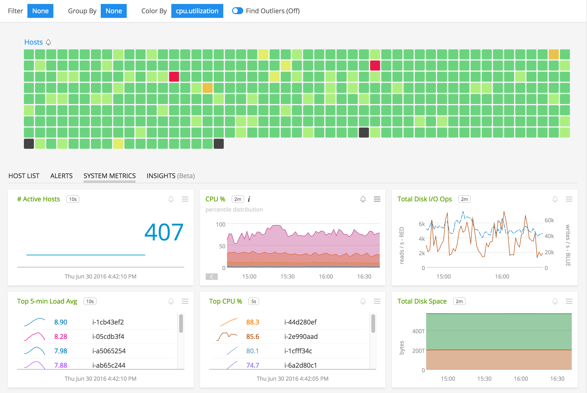
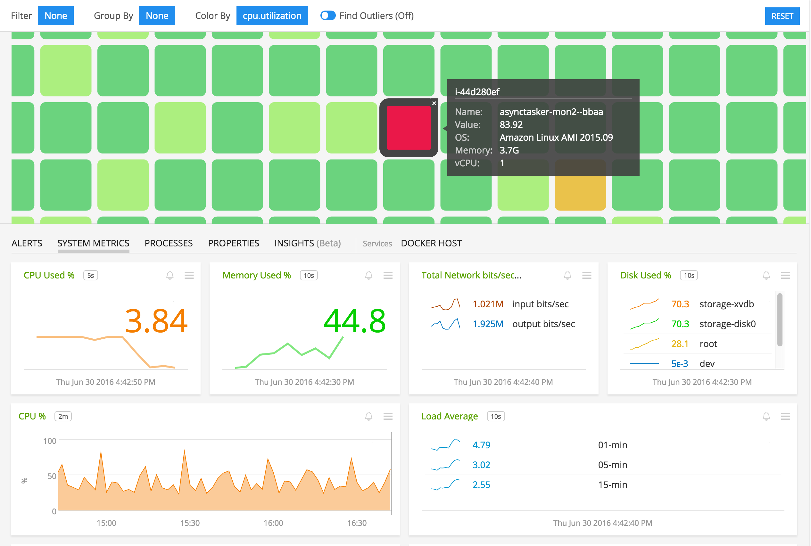

# SignalFx collectd agent

_This is a directory that consolidates all the metadata associated with the SignalFx collectd agent. The code repository for this project can be found [here](https://github.com/signalfx/collectd/)._

- [Description](#description)
- [Requirements and Dependencies](#requirements-and-dependencies)
- [Features](#features)
- [Installation](#installation)
- [Configuration](#configuration)
- [License](#license)

### DESCRIPTION

[collectd](http://collectd.org) is an open source daemon that collects statistics from a system and publishes them to a destination of your choice. You can use collectd to monitor infrastructure metrics, and install collectd plugins that monitor a wide range of software. It’s fast, performs well at scale, and enjoys great community support. We released the [SignalFx collectd agent](https://github.com/signalfx/collectd) to make a great agent even better.

The [SignalFx collectd agent](https://github.com/signalfx/collectd) introduces the following changes from community collectd:

* **Increased Character limit:** We’ve increased the number of characters that can be used in dimension key-value pairs to 1024, up from 64. In practice, this allows you to send as many dimensions as you want.
* **Buffer Flushing:** To ensure that metrics always arrive in a timely manner, we’ve added a timer to ensure that data is transmitted either when the data buffer is full or when a time limit is reached, whichever happens first. This capability is particularly useful if you are only collecting small quantities of time-sensitive metrics.
* **HTTP Error Logging:** We’re providing greater visibility into how collectd itself is functioning, by logging HTTP codes from unsuccessful data transmissions by the `write_http` plugin, and by logging the name of every plugin that is loaded at startup.

All changes have been submitted back to the [collectd project](http://collectd.org) for the benefit of the community at large.

### REQUIREMENTS AND DEPENDENCIES

The SignalFx collectd agent is supported on the following operating systems:

| Operating System  | Version        |
|-----------|----------------|
| Amazon Linux | 2014.09, 2015.03, 2015.09, & 2016.03 |
| Debian  | 7 & 8 |
| Mac OS X | 10.8+ |
| RHEL/Centos | 6.x & 7.x |
| Ubuntu  | 12.04, 14.04, 15.04 & 16.04 |

### FEATURES

Sending data using collectd allows you to take advantage of SignalFx’s extensive collectd support.

- The SignalFx Hosts page visualizes hosts that are monitored using the SignalFx collectd agent.
- SignalFx provides built-in dashboards to show infrastructure data as reported by the SignalFx collectd agent.
- SignalFx provides validated plugins for collectd to help you monitor specific software in your environment. Browse plugins that have been validated by SignalFx [here on Github](http://signalfx.github.io), or on the Integrations page in SignalFx.
- The [SignalFx metadata plugin for collectd](../collectd-signalfx) is a plugin that enriches your data by sending metadata about your hosts to SignalFx. This plugin is included by default in SignalFx’s collectd packages.





### INSTALLATION

#### Install with shell script

SignalFx provides a shell script that you can use to install the SignalFx collectd agent, including important plugins. Follow these instructions to install the SignalFx collectd agent on a system for which you have administrator (sudo) privileges.

If you have already installed collectd on your own, this script will install the [SignalFx metadata plugin](../collectd-signalfx) and configure collectd to send metrics to SignalFx.

**1. Download and run the script**

 Run the following command in your command-line, replacing `API_TOKEN` with your API token. To view the API token for your organization, open [your profile page in SignalFx](https://app.signalfx.com/#/myprofile) and click "Show" next to the API token for the corresponding organization.

        sudo curl -sSL https://dl.signalfx.com/collectd-install | bash -s API_TOKEN

 This command will download and run the script. On startup, the script will ask you to confirm that you want to proceed.

**2. Provide your hostname**

 During the configuration phase, the script will ask you to provide your system's hostname.

 * Type `dns` and press enter to automatically collect this system's hostname from DNS.
 * Type `input` and press enter to provide the hostname yourself. When prompted, type in your desired hostname and press enter.

When the script successfully completes, the SignalFx collectd agent starts up and begins reporting metrics to SignalFx.

##### Note: Additional installer options

The instructions above apply to most installation scenarios. For more information on available configuration options for this script, please see complete documentation here on Github: https://github.com/signalfx/signalfx-collectd-installer/blob/master/README.md

##### Note: Uninstalling from Mac OS X

When the install script installs the SignalFx collectd agent on a Mac OS X system, an `uninstall.sh` script is laid down in the directory `/usr/local/share/collectd`. Run this script with administrative privileges to remove collectd and all related configuration from the host. Run the script with `–help` option for detailed instructions, including how to perform a dry run and keep configuration in place after uninstalling.

#### Additional installation options

##### Chef cookbook: `chef_install_configure_collectd`

SignalFx supports a Chef cookbook that installs the SignalFx collectd agent and validated plugins. Access it here on Supermarket: https://supermarket.chef.io/cookbooks/chef_install_configure_collectd

##### Puppet module: `signalfx/collectd`

SignalFx provides Puppet modules to install the SignalFx collectd agent and important plugins. Access it here on Puppet Forge:
https://forge.puppet.com/signalfx/collectd

##### Manual step-by-step installation

If you wish to manually complete the steps that SignalFx's shell script performs automatically, check out the source here on Github: https://github.com/signalfx/signalfx-collectd-installer/blob/master/install.sh

### CONFIGURATION

The SignalFx collectd agent is accompanied by a default configuration file, `collectd.conf`, that does not need to be modified in order to function.

An example configuration file for the SignalFx collectd agent can be found [here](./collectd.conf) in this repository.

#### Using the SignalFx metrics proxy

If instances of collectd are unable to transmit outside the network, the SignalFx metrics proxy can be used to receive connections from many instances of collectd, and forward transmissions to SignalFx using a single outgoing HTTP connection. This is suitable for environments in which transmissions exiting a network are highly restricted.

[Click here to read more about the SignalFx metrics proxy](https://github.com/signalfx/integrations/tree/master/metricproxy).

#### Transmitting through an existing HTTP proxy

The SignalFx collectd agent can be configured to use an HTTP proxy if needed. The changes would need to be made on files that are sourced by the init scripts. Modify or create the indicated file, with the following contents:

On CentOS/RHEL: `/etc/sysconfig/collectd`

On Debian/Ubuntu: `/etc/default/collectd`

Sample contents of the file:
```
export http_proxy="http://HTTP_PROXY:PROXY_PORT"
export https_proxy="https://HTTPS_PROXY:PROXY_PORT"
```

Replace `HTTP_PROXY` and `HTTPS_PROXY` with the hostname of the HTTP proxy to be used, and `PROXY_PORT` with the port at which to access it.

### LICENSE

This integration is released under the Apache 2.0 license. See [LICENSE](./LICENSE) for more details.
